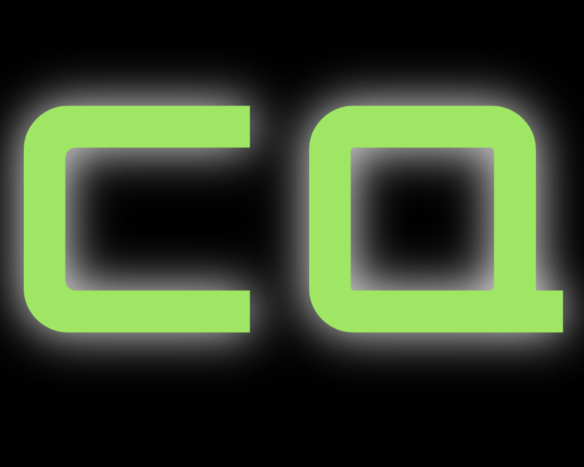

## Description

In the year 2237, humanity has ventured beyond the confines of Earth, exploring the vast expanse of the cosmos. You and your team have been selected to embark on a perilous mission to traverse the uncharted depths of the galaxy, seeking the lost ship, Elysium. Elysium is rumored to have been in possession of the Cosmic Heart: an advanced terraforming device capable of reshaping planets or wielding catastrophic power.

Your journey will take you to distant planets, each with its own unique challenges and opportunities. Encounter extraterrestrial beings, from peaceful diplomats to hostile invaders, forcing you to make choices that will shape the course of your adventure. Your job is to find Elysium and the Cosmic Heart.

The fate of humanity and the universe is in your hands.

## Table of Contents 

- [Installation](#installation)
- [Usage](#usage)
- [Credits](#credits)
- [Built With](#built-with)
- [Contribute](#how-to-contribute)
- [License](#license)

## Installation

1. Clone project repository down into your desired directory 
2. Open project terminal in the root level and run the command `npm install` to install the packages and dependencies. Installing in the root level will install the dependncies and packages for both the Client and Server
3. In that same terminal, run the command `npm run develop`, this will concurrently start the Client and Server
4. Visit the application at https://localhost:3000 

## Usage

Text-based Scifi Video game using restful API.

To add a screenshot, create an `assets/images` folder in your repository and upload your screenshot to it. Then, using the relative filepath, add it to your README using the following syntax:

    ```md
    
    ```

## Credits

List your collaborators, if any, with links to their GitHub profiles.

If you used any third-party assets that require attribution, list the creators with links to their primary web presence in this section.

If you followed tutorials, include links to those here as well.


## Built With

[](https://github.com/mandi7469) [](https://www.npmjs.com/package/react) [](https://www.npmjs.com/package/vite) [](https://www.npmjs.com/package/bootstrap) 


## How to Contribute

If you would like to contribute, please refer to the Contributor Covenant guidelines on how to do so.

The [Contributor Covenant](https://www.contributor-covenant.org/).


## License

This project is licensed under the ISC license.