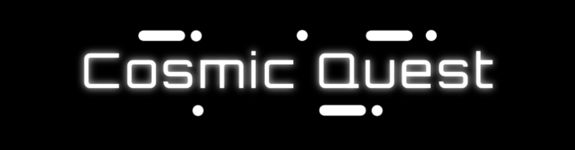

## Description

In the year 2237, humanity has ventured beyond the confines of Earth, exploring the vast expanse of the cosmos. You and your team have been selected to embark on a perilous mission to traverse the uncharted depths of the galaxy, seeking the lost ship, Elysium. Elysium is rumored to have been in possession of the Cosmic Heart: an advanced terraforming device capable of reshaping planets or wielding catastrophic power.

Your journey will take you to distant planets, each with its own unique challenges and opportunities. Encounter extraterrestrial beings, from peaceful diplomats to hostile invaders, forcing you to make choices that will shape the course of your adventure. Your job is to find Elysium and the Cosmic Heart.

The fate of humanity and the universe is in your hands.

## Table of Contents

- [Installation](#installation)
- [Usage](#usage)
- [Credits](#credits)
- [Built With](#built-with)
- [Contribute](#how-to-contribute)
- [License](#license)

## Installation

1. Clone project repository down into your desired directory
2. Open project terminal in the root level and run the command `npm install` to install the packages and dependencies. Installing in the root level will install the dependncies and packages for both the Client and Server
3. In that same terminal, run the command `npm run develop`, this will concurrently start the Client and Server
4. Visit the application at https://localhost:3000

## Usage

Cosmic Quest is a text-based Scifi Video game using restful API.

## Credits

GitHub: [Heatherellen Strain](https://github.com/hestrain)

GitHub: [Amanda Changa](https://github.com/mandi7469)

GitHub: [Jordan Reeve](https://github.com/jreeve65)

GitHub: [James Parker](https://github.com/JamesWilliamParker)

Cosmic Quest: [Deployed Website Link]()

## Built With

 

## How to Contribute

If you would like to contribute, please refer to the Contributor Covenant guidelines on how to do so.

The [Contributor Covenant](https://www.contributor-covenant.org/).

## License

This project is licensed under the ISC license.
